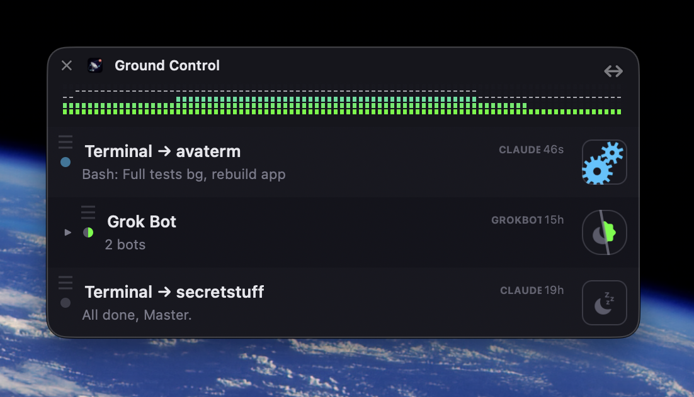
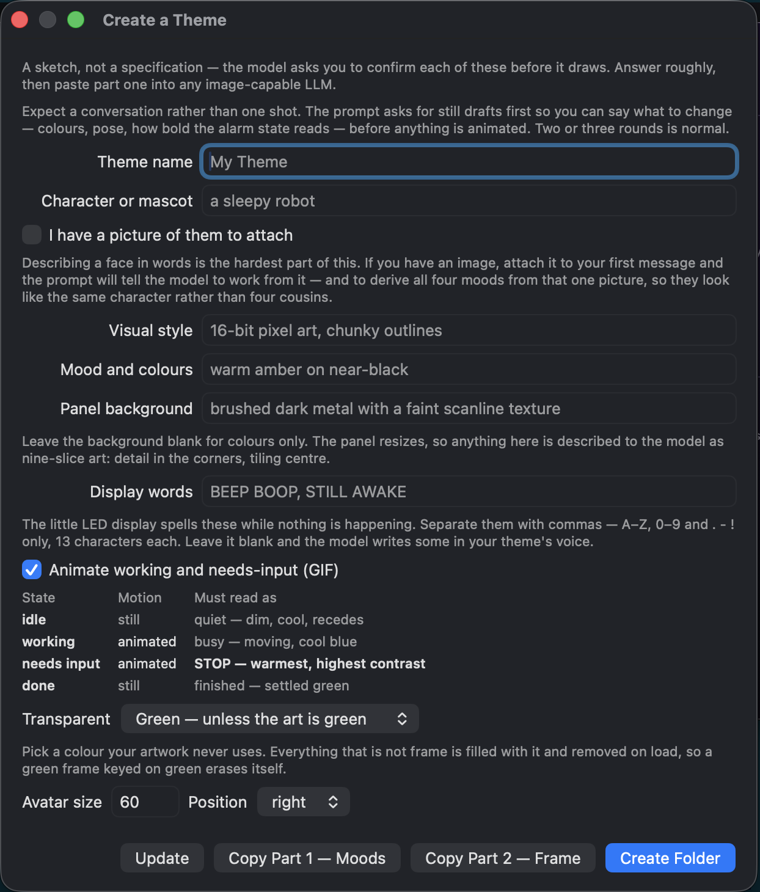
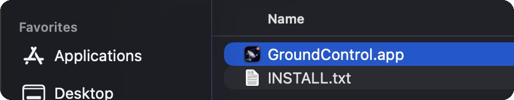
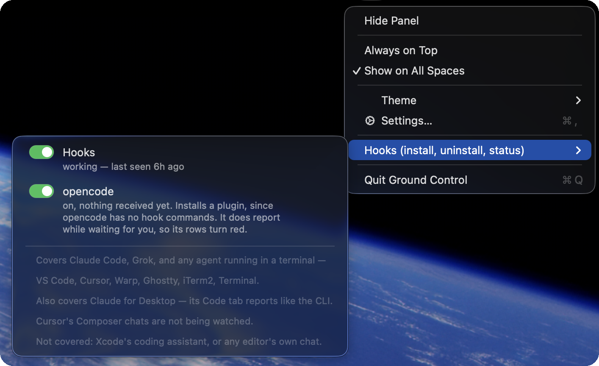
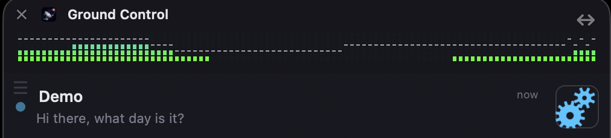

<h1 align="center">🛰&nbsp; Ground Control</h1>

<p align="center">
  <strong>Mission control for every AI agent you're running — and one click to jump to it.</strong>
</p>

<p align="center">
  
  
  
  
  
</p>

**Say you've got three Claude Code sessions running.** Here's how Ground Control
shows them:

- name and current line, per session
- a dot that goes **red** the moment one is blocked and waiting on you
- click a row → its terminal tab jumps to the front

<div align="center">



</div>

That's the default look. The whole thing is a theme, though — a drop-in folder of
images and JSON — so it can look like this instead:

<div align="center">

https://github.com/user-attachments/assets/adfacf3a-ce9b-4c9b-a915-0e2d8dc0865f

</div>

# Why

> *"I waste time checking whether my session is done, or waiting on me."*

You start an agent so you can go do something else. Then it needs a decision,
and you're caught between two ways of losing:

- **You don't check.** It sits blocked for twenty minutes, waiting on one word.
- **You do check.** Every check is a context switch away from whatever you moved
  on to — and most turn up nothing.

The cost was never the waiting. It was the checking.

> **Ground Control is the third option — a glance instead of a context switch.**

# How

- **A row per session** — name, what it's doing now, and a dot that turns
  **red** the moment it's blocked and needs you.
- **One click to the terminal** — the exact tab in Terminal and iTerm2, the app
  itself for VS Code, Cursor, Warp, Ghostty and WezTerm.
- **A menu-bar icon** that badges the instant anything needs you.
- **Skinnable, WinAmp-style** — swap the whole look in seconds.
- **Runs on the CLIs you already use** — Claude Code and Grok CLI today,
  opencode and Cursor covered too. → **[full compatibility, tested on real
  sessions](#what-it-works-with)**

# See it in action

**Click a row, land on its terminal** — the exact tab, or the owning app for
editors that can't be scripted.

<div align="center">

https://github.com/user-attachments/assets/357f529c-eca2-4884-b8e6-a7bdfc86a880

</div>

**Swap the entire look.** Themes are drop-in folders of images and JSON — even
the title-bar analyser's motion is a theme's to change.

<div align="center">

https://github.com/user-attachments/assets/a87cbf31-a39c-42ff-90a2-5e7d01f4cc72

</div>

**Make your own without writing JSON.** Answer a handful of rough questions —
character, mood, style — and **Create a Theme** writes the prompt. Paste it into
any image-capable LLM; it draws the four faces and the frame, and you drop the
folder in.

<p align="center">
  
</p>

More video — the analyser, resizing, the whole theme flow — is on the
[SpacyApps page](https://www.spacyapps.com/apps/ground-control).

# Make it yours

- The station is one folder — swap it for a unicorn, an aquarium, or something
  nobody's drawn yet.
- A theme is a folder you can hand to a friend.
- **Create a Theme** writes the prompt; you don't have to draw at all.
- More on the way.

> **Running a dozen agents should feel like mission control, not inbox triage —
> and it's allowed to be fun.**

# Install (non-developers)

## 1. Install the app

- Download the `.zip` from the **Releases** page, unzip it, and drag
  **Ground Control** into Applications.
- It is signed with a Developer ID and notarised by Apple, so it opens on a
  double-click — no right-click, no warning.



## 2. Connect your agent

The panel stays empty until an agent reports in. Either run:

```bash
/Applications/GroundControl.app/Contents/Resources/install-hooks.sh
```

…or click the menu-bar icon and open **Hooks** — a switch per agent, and a line
under each saying whether anything has arrived from it yet.



- **Run it once.** Later versions of the app keep the installed emitter up to
  date on their own.
- It **merges** into `~/.claude/settings.json` — hooks you already have keep
  working — and backs the file up first.
- One install covers **Claude Code**, **Grok CLI**, and **Claude for Desktop**
  (its Code tab bundles Claude Code).
- Using **Cursor**? It also writes `~/.cursor/hooks.json` — **restart Cursor**
  afterwards. Nothing else needs restarting.

## 3. Start a session

- Open a **new** terminal — a CLI that was already running has not loaded the
  hooks.
- Start Claude Code or Grok CLI. A row appears the moment it does anything.



- **Click a row** to jump to its terminal — the exact tab in Terminal and
  iTerm2, the app itself for VS Code, Warp, Ghostty and WezTerm.
- The **menu-bar icon** toggles the panel and opens Settings, where you pick a
  theme. **Theme → Open Themes Folder…** is where your own themes go.

## Nothing showing up?

- Open the **Hooks** submenu — the line under each agent says whether anything
  has arrived. "nothing received yet" means the CLI is not calling the emitter.
- Was the terminal opened *after* you ran the installer? Hooks load at startup.
- A click opening **Finder** instead of your terminal means the hooks predate
  that support — re-run the installer.
- Hooks are never allowed to interrupt your agent, so `cc-notify` fails silently
  by design. `docs/LIMITATIONS.md` covers what that can hide.

---

*Everything below is for building from source and the technical detail. Status:
alpha — the app is built and notarised, and the hook side is verified against
live payloads from Claude Code, Grok CLI, Cursor and opencode. `docs/SPEC.md` is
the event contract, `docs/STRUCTURE.md` the code layout, `docs/LIMITATIONS.md`
what is proven versus merely believed.*

# Build (from source)

```bash
swift build
swift run GroundControl
```

Requires macOS 13+ and Swift 5.9+. **No third-party dependencies** — the app
imports only AppKit, AVFoundation, Foundation and os. Linting uses the
standalone `swiftlint` binary (`brew install swiftlint`).

# How it works

Claude Code hooks call a small script (`Scripts/cc-notify`) that writes one
`.jsonl` file per session into a temp folder, named by the session's id. The
app watches that folder — **file exists ⇔ row exists** — and shows the last
line of each file as that session's current state. Files untouched for 24h are
purged automatically.

Rows show what Claude actually said, not a generic status: the `Stop` hook
hands over the full assistant message, and `Notification` carries the real
"waiting for you" text.

```bash
./Scripts/install-hooks.sh    # installs cc-notify + merges into ~/.claude/settings.json
```

It **merges** — existing hooks on the same events keep working — and backs up
your settings first. Hooks take effect immediately; no restart.

# The one feature we built, proved, and then deleted

The obvious next step was answering an agent from your phone. *Approve* or *deny*
is the easy half. But approve and deny aren't what you actually need to send —
you need words: *use Postgres, not SQLite.* The only route to words was scripting
your terminal directly.

We built that. It works.

Which is exactly where it stops. Anything that can type into your terminal is a
remote-execution capability, and a relay in that path turns one compromised
server into every Mac connected to it. A *yes* tapped on a lock screen isn't the
same *yes* — you can't see the working directory, the diff, or what the last
three approvals already unlocked, and approvals chain.

**No relay was ever built.** The app's `TerminalFocuser` only ever *navigates* —
it brings a window forward. It cannot type, run a command, or do damage if it
misfires. If you want remote answering, Claude Code ships it natively now, with a
better security model than we could have justified building.

> Finding out you can do something is not the same as finding a reason to.

# What it works with

Every row below was tested on a real session, not inferred. Dates are when, and
`docs/LIMITATIONS.md` says how.

## Agents

| Agent | Rows | Turns red | How we know |
|---|---|---|---|
| **Claude Code** | yes | **yes** | a blocked session turned red, the click landed on its tab, the alarm cleared · 2026-08-12 |
| **Grok CLI** | yes | **yes**, partly | `elicitation_dialog` turned a row red carrying the question itself; a question asked in prose still reads as "done" · 2026-08-19. It reads `~/.claude/settings.json` by design, so one install covers both · 2026-08-11 |
| **Grok Bot** | yes, grouped | **yes** | every bot under one collapsible group; a decision card waiting on your answer turns that bot and the group red, checked live against Grok Bot's own cache · 2026-08-28 |
| **opencode** | yes | **yes** | `permission.asked` carried "List files with details in current directory"; row went red and cleared on reply · 2026-08-19 |
| **Cursor's own agent** (Composer) | yes | **no** | fires no hook while waiting for approval, so a blocked chat looks busy · 2026-08-14 |
| **Claude for Desktop** — Code tab | yes | **yes** | it bundles its own Claude Code and spawns it as a child, so hooks run; a permission prompt turned the row red · 2026-08-22 |
| **Claude for Desktop** — Home tab | **no** | no | ordinary chat in Electron; no process is spawned, so there is nothing to hook — and nothing to miss, since a chat cannot block you unnoticed · 2026-08-22 |
| **Xcode's Claude Agent** | **no** | no | it *is* Claude Code (`sdk-cli`) and can see both the config and the emitter, but that entrypoint does not run hooks · 2026-08-19 |

## Terminals

Any agent running in a terminal is covered by that agent's row — the terminal
needs no integration of its own. Clicking a row jumps to the exact tab where the
terminal can be scripted, and raises the app otherwise.

| Terminal | Jump lands on | How we know |
|---|---|---|
| **Terminal.app** | the exact tab | clicked a row, landed on the right tab · 2026-08-10 |
| **iTerm2** | the exact tab | tty resolved across three sessions in two panes · 2026-08-12 |
| **VS Code** | the app | session with no tty at all; clicking raised the editor · 2026-08-12 |
| **Cursor** (its terminal) | the app | row appeared, went red for a permission prompt, click raised Cursor · 2026-08-14 |
| **Warp · Ghostty · WezTerm** | the app | same path as VS Code — outermost `.app` from the process tree |

**The pattern, for anything not listed.** An agent that runs a command on its own
events can be supported; one that does not, cannot. An editor's built-in chat is
usually the second kind — Composer and Xcode's agent both are, in different ways.

See `docs/SPEC.md` §3 for the event contract, `docs/HOOK-PAYLOADS.md` for the
measured payloads it is built on, `docs/ARCHITECTURE.md` for how a hook event
becomes a row, and `docs/LIMITATIONS.md` for what is proven
versus merely believed.

# Themes

**Fun is a feature.** Every other menu-bar utility assumes you want it to look
like everything else; this one is WinAmp-skinnable instead — copy
`Themes/default/` and edit `theme.json`. Everything is optional — the app
fills in defaults.

`Themes/spacyAppsLunarAvatar/` is a complete example: per-state avatars, a
shaped window whose antennae extend past the panel edge, and its own matrix
messages. Full guide: `docs/THEMING.md`.

A skin can go **behind** the rows or **in front of** them (`window.overlay`),
which is how a picture frame overlaps its own contents. Artwork arrives from
image models without usable alpha, so `removeBackground` chroma-keys it at load
and suppresses the rim the key leaves behind. The ✕ and ↔ marks always draw
above the skin, so no theme can hide the only ways to close and resize the
panel.

The title-bar analyser can run a theme's own bar-height formula
(`matrix.shape`). Preview one in the terminal without launching the app:

```
swift run matrix-preview "0.5 + 0.5*sin(pos*7 - phase*2)"
```

# Uninstall

Click the menu-bar icon, open **Hooks**, and turn the agents off — or run
`~/.groundcontrol/bin/uninstall-hooks.sh`, which is kept there so it still works
after the app is gone. It takes the `cc-notify` entries out of
`~/.claude/settings.json` (a dated backup sits beside it). The emitter and
uninstaller live in `~/.groundcontrol/bin/`; session files sit in a temp folder
and clear themselves. Themes are in
`~/Library/Application Support/GroundControl/Themes/`.

# License

AGPL-3.0-or-later — see `LICENSE`.

- Use it, study it, change it, share it — including commercially.
- Distribute it and you must pass on the same freedoms, with source, under the
  same licence.
- **Affero adds the network case:** run a modified version as a service and its
  users must be offered the source. The app itself makes no network connections,
  so this only ever applies to something built on top of it.
- **Themes are not covered.** They are plain folders of images and JSON, not a
  derivative of the code. Artwork carries whatever licence its author gives it —
  ask whoever made a theme before redistributing it.
- **Need different terms for your organization?** Copyright is held by one
  person specifically so this is possible — email spacyapps@gmail.com to ask.

# Contributions

- **Not accepting code** — no pull requests, patches, or pasted snippets.
- **Bug reports, feature requests and themes are very welcome.** The most
  useful thing you can send is a clear description of what happened.
- Found a fix? Describe the problem and it will get written.
- Why: one merged contribution means the licence can never change again without
  tracking that person down for permission. Keeping sole copyright is what
  makes it possible to offer this under other terms later.
