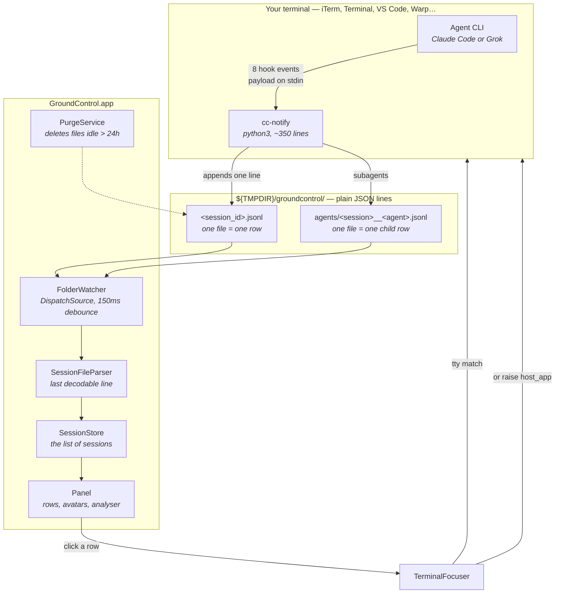

# How a row appears

Ground Control never talks to your agent. It watches a folder of text files that
a small script writes, and draws a row per file. That one boundary explains most
of the design.

## The four steps

Everything hangs on the first step: an agent has to *tell* the script something.
Claude Code and Grok do. An assistant with no user-installable hook — VS Code's
own Copilot chat, for instance — never calls the emitter and so never appears,
even while running commands in a terminal of its own. Claude Code inside that
same editor appears normally, because the hook fires wherever the CLI runs.

**1. The CLI fires a hook.** `~/.claude/settings.json` registers one command —
`~/.groundcontrol/bin/cc-notify` — against eight events: `SessionStart`, `UserPromptSubmit`,
`PreToolUse`, `Notification`, `Stop`, `SubagentStart`, `SubagentStop`,
`SessionEnd`. The CLI runs it and hands it a JSON payload on stdin. Grok reads
the same settings file and sends the same events in camelCase, so one script
serves both.

**2. The script writes one line.** `cc-notify` turns the payload into a row's
worth of state — is it working, waiting on you, or done; what to show as the
message — and appends a single JSON line to that session's file. It also resolves
three things the app cannot see for itself, because only a process inside your
terminal can:

| Field | Found by |
|---|---|
| `tty` | walking up the process tree to the first controlling terminal |
| `host_app` | walking up to the first ancestor running from `<app>.app/Contents/MacOS/` |
| `host_id` | `__CFBundleIdentifier`, which macOS sets on an app and children inherit |

The script and the app are two halves of one contract, installed separately, so
the app replaces an out-of-date `cc-notify` with its own copy at launch — only
updating one that is already there, never installing or registering anything.

**The script must never block your agent**, so every failure path exits 0 in
silence. That is also its worst property: a wrong field name and a working setup
look identical from outside. See `docs/LIMITATIONS.md`.

**3. The app notices.** A `DispatchSource` on the directory fires on any add,
change or removal. Writes arrive in bursts, so they are coalesced over 150ms
into one reload. The parser reads only the **last decodable line** of each file —
that line is the row's current state, which is what makes the format append-only
and crash-proof: a half-written line is skipped, and history is never replayed.

**A row is a channel, not a log.** What it shows is the first line of whatever
the agent last said, which means the opening sentence of an answer is the part a
person reads at a glance. Worth writing deliberately rather than letting it be
whatever preamble came out — an observation from a Claude Code session that
found its own row while being watched by it.

**4. Rows are drawn.** One file, one row. Files under `agents/` become child rows
grouped beneath their parent session. Files untouched for 24 hours are deleted,
so a forgotten terminal does not haunt the panel forever.

One exception to "the app reads; it does not probe" the diagram above doesn't
show: Grok's `spawn_subagent` fires no hook at all, so its children never reach
`agents/`. `SessionAggregator` folds them in separately, by reading a small file
Grok already writes for itself — see `docs/GROK-SUBAGENT-GROUPING.md`. Same
shape as Grok Bot's own group (`docs/GROK-BOT-GROUPING.md`) and OpenAI Codex's
rows (`docs/CODEX-INTEGRATION.md`, no alarm — its one real "needs you" moment
writes to no file at all): a producer merged in beside `SessionStore`, never
inside it.

## Clicking a row goes back the other way

`TerminalFocuser` takes you to the session using what the script recorded:

1. **The exact tab**, when the session is *in* iTerm or Terminal — those expose a
   tty per tab, so the match is precise. A tty belongs to whichever app opened
   it, so this search only runs when `host_app` names one of them (or names
   nothing, for sessions written before that field existed).
2. **The host application**, otherwise. VS Code, Cursor, Warp and Ghostty all own
   real ptys belonging to no scriptable tab, so the best available answer is to
   raise the app itself.
3. **The folder in Finder**, if neither is reachable.

Only the first two count as *arriving*, and only arriving clears a row's alarm.
Silencing an alarm nobody attended to is the one thing a monitor must not do.

## Why a folder of text files

The alternative was to read the CLI's own transcripts or probe the system for
terminals. Both were rejected:

- **Testable.** `Monitoring` is unit-tested from fixture files with no window on
  screen and no agent installed.
- **Survivable.** A CLI update can only ever break the *script* — one file, no
  Swift changes, no release.
- **Honest.** The app reads; it does not probe. It never parses transcripts,
  never shells out to find a terminal, and never reads `~/.claude/`.

Its entire input is one folder of JSON lines. You can watch the whole system
work with `tail -f`.
